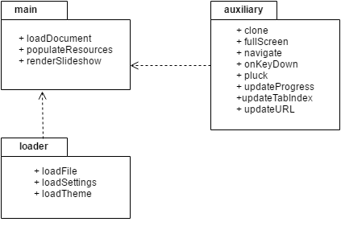
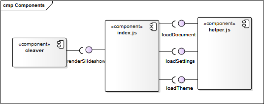
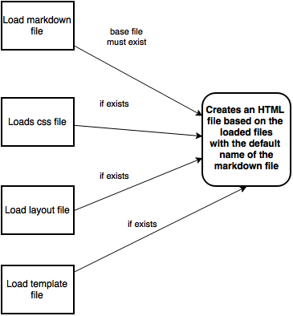

# Cleaver

## Table of Contents
* [Cleaver](#cleaver)
    * [Software Design](#intro-sd)
        * [Introduction to Software Architecture and the 4+1 Architectural View Model](#introduction)
            * [What is software architecture?](#introduction-sa)
            * [The 4+1 Architectural View Model](#introduction-vm)
            * [Architectural Patterns in Cleaver](#introduction-ap)
        * [Logical View](#logicview)
        * [Development View](#dvpview)
        * [Deployment View](#dployview)
        * [Process View](#prcssview)
    * [Contribution of Team Members](#contributions)

## Software Design

## Introduction to Software Architecture and the 4+1 Architectural View Model

### What is Software Architecture?

Software architecture is the process of defining the fundamental organization of a software system that meets all of its technical and operational requirements, while optimizing said system for performance, security, and manageability. It involves a series of decisions based on a wide range of factors, with each decision having a significant impact on the system’s quality, maintainability, performance and overall success of the application. 

Martin Fowler, a renowned author of multiple books on software development, outlines some of the recurring themes of software architecture in *Patterns of Enterprise Application Architecture* as: 

“The highest-level breakdown of a system into its parts; the decisions that are hard to change; there are multiple architectures in a system; what is architecturally significant can change over a system's lifetime; and, in the end, architecture boils down to whatever the important stuff is.”

### The 4+1 Architectural View Model

The 4+1 view model is a framework which defines a coherent and concurrent set of views to describe a system’s architecture designed by Philippe Kruchten, a software engineering professor and the author of multiple books on software development. These views are used to describe the system from the viewpoint of its different stakeholders (e.g. users, developers), and are divided into four core ones:
* **Logical View** - The logical view illustrates the functionality the system is able to provide to its end-users and is often represented by UML diagrams such as class diagrams (where each individual class and its relationship with other classes is defined), object diagrams (where the relationships between certain structural elements are represented), package diagrams (where the model is divided into different logical containers), composite structure diagrams (where classes are often divided into parts and the relationship between said parts is made explicit) and state machine diagrams (where the instant state of an object defined by a class is made explicit).
* **Development View** - The development view, or implementation view, depicts the system from a developer’s perspective, focusing on the software module organization in the development environment. The diagrams traditionally used to represent this view are Component Diagrams, which are used to represent precisely the software components built in a system as well as their dependencies.
* **Process View** - The process view makes explicit the dynamic aspects of the system, notably, the system processes and how they communicate, as well as the runtime behavior of the system. The view addresses aspects of the system such as concurrency, distribution, performance, scalability etc. UML diagrams used to represent this view can be sequence diagrams (where the sequence of messages passed between objects on a vertical timeline is made explicit), communication diagrams (where communications between objects at runtime during a collaboration instance is modelled), activity diagrams (where program flows and complex business logic actions are depicted), timing diagrams (where performance of a system is modelled) and interaction overview diagrams (where an overview of interactions working together to implement a system concern is made explicit).
* **Deployment View** - The deployment view shows the nodes that form the system’s hardware topology on which the system executes, that is, it brings into focus the software components on the physical layer and the physical connections between these. A deployment diagram written in UML is often used to represent this view.

In addition to these views, select use cases and scenarios are used to illustrate the architecture of the system. These are contained in a fifth view, the **Use Case View**, which serves to illustrate and validate the architecture’s design and is referred to as the ‘plus one’ view. 

### Architectural Patterns in Cleaver

After analyzing the project’s source code and multiple well known architectural patterns, it is clear to us that Cleaver follows a **Model-View-Controller** (MVC) pattern. 

MVC is usually used when there are multiple ways to view and interact with data, which Cleaver does provide, since you can use your own themes to change your slideshow presentation and you can also navigate through slides with your keyboard. MVC allows for Cleaver to present its data in different ways and for the data and its representation to change independently due to its aforementioned themes plugin, even if this introduces some code overhead on what is a fairly simple data model in Cleaver.

Taking into consideration the MVC pattern and the project’s source code, the project can be separated into the following parts:
* **Model** - The application’s data and state is mostly spread across three files: **clone.js**, **helper.js** and **pluck.js** in the **lib** directory. These files have the functions which are responsible for loading Cleaver’s presentations and setting up the default state of the application, as well as updating its state when given controller feedback.
* **View** - The visual representation of the data contained in the model, that is, the application’s presentation, is defined by any **css files** added by the user or the default css files in the **resource** directory of the project.
* **Controller** - Interaction with the application is done on a browser level and the functions that allow for interaction with the program are located on the **script.js** file in the **resources** library. These functions allow a user to change between slides through the navigation keys on a keyboard.

## Logical View

## Development View

## Deployment View

## Process View

## Contribution of Team Members

### needs changing

| Team member | Contribution |
| ----------  | ------------ |
| André Correia | [Development View](#dvpview) |
| João Mendonça | [Process View](#prcssview) |
| Luís Couto | [Logical View](#logicview) | 
| Nuno Silva | [Introduction to Software Architecture and the 4+1 Architectural View Model](#introduction) and [Deployment View](#dployview) |
