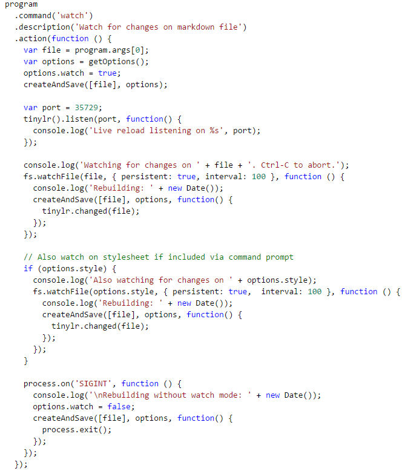
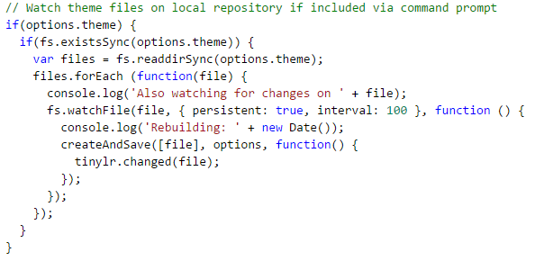

# Cleaver

## Table of Contents
* [Cleaver](#cleaver)
    * [Software Maintainability](#softwareMaintainability)
        * [Analyzing Cleaver's Code](#ancode)
        * [Analyzing Better Code Hub's Results] (#anbch)
    * [Feature Evolution Process](#evoproc)
        * [Feature Identification and Reasoning for Evolution](#featidreason)
        * [Evolving the Feature](#featevotest)
        * [Pull Request](#featurepull)
    * [Contribution of Team Members](#contributions)

## Software Maintainability

### Analyzing Cleaver's Code

Although the evolution and maintainability of Cleaver does not represent a critical need and with great economic value, the truth is that the program has been evolving in a regular way for more than 4 years. During this time, it was altered in order to maintain its original utility, correcting detected errors, maintaining or increasing its general quality, without increasing its complexity considerably and therefore without a considerable increase in the cost of its maintenance.

The greatest difficulty in the evolution and maintenance of the same will be limited to the scarce human resources available to ensure the same, although this is facilitated by the adequate documentation developed and by the simplicity and structure of the program, even if there is a lack of automation in the tests.

### Analyzing Better Code Hub's Results

After automatic computation of the metrics of the program using the service https://bettercodehub.com/, it registered a total socre of 7 (in 10).
The analysis revealed gaps previously mentioned by us and added new ones:

 - The report revealed that there are some units of code not short enough, having 3 with between 30 and 60 lines of code and 6 with between 15 and 30 lines of code, but there are none with more than 60 lines of code. It is suggested to splice them into smaller units of code, with up to 15 lines of code.

 - The analysis also revealed that there are units of code candidates for refactoring because they have more than 5 branch points, 2 of which have between 10 and 25 branch points, so it is suggested to reduce complexity by extracting sub-branches to separate units of no more than 5 branch points.

 - As far as code duplication is concerned, no problems were detected and therefore there are no suggestions for changes at this level.

 - As for unit interfaces size, only 2 refactoring candidates with between 2 and 4 per unit parameters have been reported, but these remain within the recommended maximum limit of 4 to ensure units easier to understand and reuse.

 - At the module separation level, no problems were reported, ensuring improved safety when changes are required so that they do not affect other unwanted parts.

 - Also, at the level of the coupling between architecture components, no problem was reported, so the components are isolated at the outset.

 - The program has still successfully passed the balancing tests of the architecture components, which indicates a correct balancing in the number and relative size of components.

 - As expected and already pointed out by us, the tests indicated a small codebase, capable of improving maintainability.

 - As also expected it failled in the analysis of automate tests, nonexistent in the 485 lines of code, as we have already been several times pointed out, so it is strongly suggested to implement them, for a more predictable and less risky development. Some test code and at least one assertion is required, as it is a small system.

 - Finally, as to the cleanliness of the code, 3 modules were identified that are susceptible of search and remove of code smells, as clean code is more maintainable.

## Feature Evolution Process

### Feature Identification and Reasoning for Evolution

In order to identify what feature to add to Cleaver, we analyzed [Cleaver's issue tracker](https://github.com/jdan/cleaver/issues) in order to determine what feature requests had users of the application made. We found [several](https://github.com/jdan/cleaver/issues/130) [feature](https://github.com/jdan/cleaver/issues/129) [requests](https://github.com/jdan/cleaver/issues/107), but the [one that we decided to evolve](https://github.com/jdan/cleaver/issues/128) was one we felt was essential for a program of Cleaver's nature. Being able to dynamically make changes to your theme is an integral part of the worflow for any user who wants additional control over their own slides, as having to reload the application each time a change is made is time-consuming and fairly incovenient, particularly on slower personal computers. With this feature, users can make changes to their themes on the fly without having to reload Cleaver, which should user productivity immensely.

### Evolving and Testing the Feature

Once we identified the feature we wanted to evolve, we decided to go over Cleaver's code to identify where and what code we needed to change/add to implement our feature. We found that Cleaver already did something similar to the feature requested but at a smaller scale: Cleaver was able to track changes to the presentation file given and a single css file, but not to a theme's files, through the use of the inline command `cleaver --watch`. The code for this command is the following:

Developing our feature using the code developed for this command was fairly straightforward: We simply added a check to make sure the theme specified was local (as the feature requested specified watching for changes on local themes), got all the files in the local theme's directory and used JavaScript's `watchFile()` function to watch for changes on each of the files in the local theme's directory. The code developed for this feature is the following:

Feature testing wise, due to time constrictions and a lack of a test suite to guide us in developing software tests for Cleaver, we decided to download a theme and use it locally, making changes to it and seeing if those changes were applied instead of developing a software test for the feature. We concluded that our feature was working based on this informal software testing method, and since no bugs came up during our feature testing or using the JSHint tool, we decided to create a pull request for our feature. 

### Pull Request

**[Link to pull request](https://github.com/jdan/cleaver/pull/160)**

## Contribution of Team Members

| Team member | Contribution |
| ----------  | ------------ |
| André Correia | [Software Testability and Reviews](#testandrevintro) |
| João Mendonça | [Bug and Correction](#bugandfix) |
| Luís Couto | [Software Maintainability](#softwareMaintainability) | 
| Nuno Silva | [Feature Evolution Process](#evoproc) |
