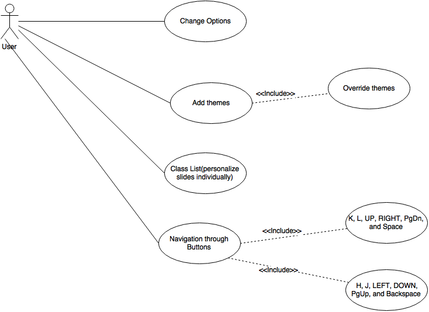

# Cleaver

## Table of Contents
* [Cleaver](#cleaver)
    * [Requirements](#introreq)
        * [Specific Requirements and Features](#specreqandfeat)
        * [Use Cases](#usecases)
        * [Domain Model](#domainmodel)

## Requirements
Requirements are described by Sommerville and Sawyer as “descriptions of how the system should behave, or of a system property or attribute” [1]. In Cleaver, we can identify two distinct requirement specification stages: The first stage, corresponding to the beginning of the project, is related to the developer motivations. In this stage the scope of the project was defined as well as the initial set of requirements. The second stage corresponds to the continuous and incremental development of the project. This stage started with the project's public release, and is still ongoing. It is possible to see that the project authors adopted an iterative development methodology, where with each iteration new features are added.

As so, the boundaries of the project were defined in the initial stage by its main purpose: "simplest way to generate static HTML presentations from a simple JSON format” [2]. The author also established the intended programming and definition languages, namely Javascript. It is possible to state that the requirements were derived from the developer's social observation and analysis, in order to support an easier workflow for people willing to learn Markdown. The developer also tried to fill a gap in the slideshow context, by going with this Markdown-oriented approach. As part of the requirements was also the specification of the framework supporting the application, namely NodeJS. 

In the second stage, the requirements where additionally defined by the final users (the system stakeholders). Concerning the addition of requirements, the GitHub platform has the "Issues" feature, which allows users to submit issues found in the application, or request new features.

The “Issues” feature can obviously lead to several problems, namely: Problems in understanding the user requirements if they are not well explained; And/or volatility of the issues/features if the users make requests on whims instead of actual needs; Different and/or conflicting views of the project's objectives amongst contributors; Communication problems, possibly hampered by language barriers,  which can lead to difficulties in understanding what requirements the users intend to convey. In practice, “Issues” (i.e., bugs and new features) can be classified according to several aspects, namely Bug, Duplicate, Enhancement, Invalid, Question and Wontfix. Thus, the decision on which features to implement can often rely a bit too much on the developer's own view of the projects and objectives while perhaps not giving enough emphasis on the collective desires of the user base.

[1] Ian Sommerville and Pete Sawyer, Requirements Engineering: A Good Practice Guide. ISBN: 978-0471974444, 1997.
 
[2] [Cleaver website](https://github.com/jdan/cleaver)

## Specific Requirements and Features

### Functional Requirements
* Creates HTML presentations from Mardown language;
* Provides users with the ability to easily share a presentation online. It’s also possible to print the presentation to a PDF;
* Author credits supports several fields like name, url to author’s website, email, twitter and other social media accounts. It creates a basic author credits slide at the end of the presentation;
* Supports several options for adding customization to presentations. These options, placed at the top of the document, are in YAML format;
* Provides theme support. Gives an easy way to plug styles, scripts and templates into presentations. The main goal is to bring more fine-grained control over presentation. Instead of manually specifying a stylesheet, template, layout and others it’s possible to specify a single theme containing each of these assets. More specifically, a theme may contain:
   * style.css - styles for presentation;
   * template.mustache - a template used to render the slides in the presentation;
   * layout.mustache - a template used to render the entire document of presentation;
   * script.js - javascript to be included in slideshow.
* Themes may be specified by one of the following options:
   * An absolute or relative path to a directory;
   * An URL to a directory;
   * A github repostitory in the form of username/reponame.
* An option determining whether or not want to render simple navigation buttons on the presentation (by default this value is true). To navigate the slideshow it’s possible to use keyboard too;
* An option determining whether or not want to render a progress bar on slides (by default this value is true);
* Full screen support.

### Non-Functional Requirements
* Easy utilization;
* Simple syntax;
* Make presentations compatible with several devices including mobile devices;
* No need to learn a new programming language;
* No need to install new software;
* Encoded in UTF-8.

## Use Cases

### Stakeholders

The only stakeholder in the application is the User, that is, any individual that makes use of the application.

### User stories

* As a User, I want to edit my options so I can customize the look and feel of my presentation, which includes author info, stylesheets, and custom templates;
* As a User, I want to be able to add my own themes so I can make the slides my own with deeper customization options;
* As a User, I want to be able to navigate through my presentation with keyboard buttons so I can easily move through the slides;

## Domain Model

The domain model for Cleaver is relatively simple, with its conceptual classes mostly consisting of a **Core** class representing the application itself and a **Theme** class, representing the theme plugin supported by the application:

