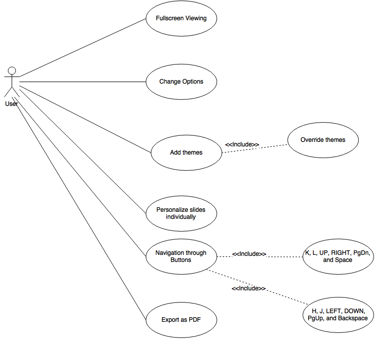

# Cleaver

## Table of Contents
* [Cleaver](#cleaver)
    * [Requirements](#introreq)
        * [Specific Requirements and Features](#specreqandfeat)
        * [Use Cases](#usecases)
        * [Domain Model](#domainmodel)

## Requirements

## Specific Requirements and Features

## Use Cases
* As a user i want to change options so i can customize the look and feel of my presentation, including author info, stylesheets, and custom templates.
* As a user i want to be able to add my own themes so i can make the slides my own
* As a user i want to be able to navigate through my presentation with keyboard buttons so i can easily move throughs slides

## Domain Model

The domain model for Cleaver is relatively simple, with its conceptual classes mostly consisting of a **Core** class representing the application itself and a **Theme** class, representing the theme plugin supported by the application:

